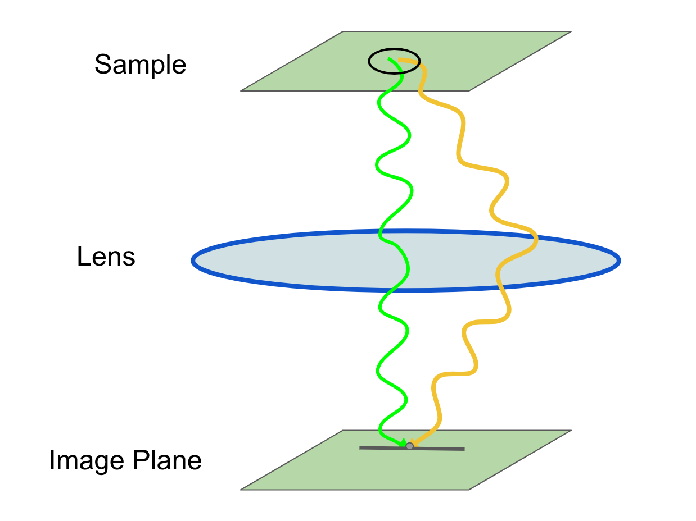
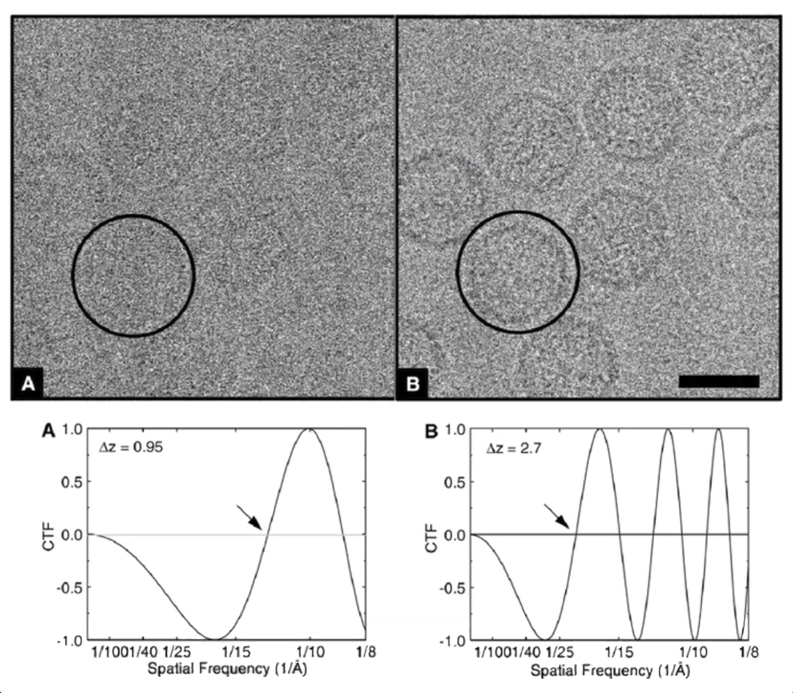
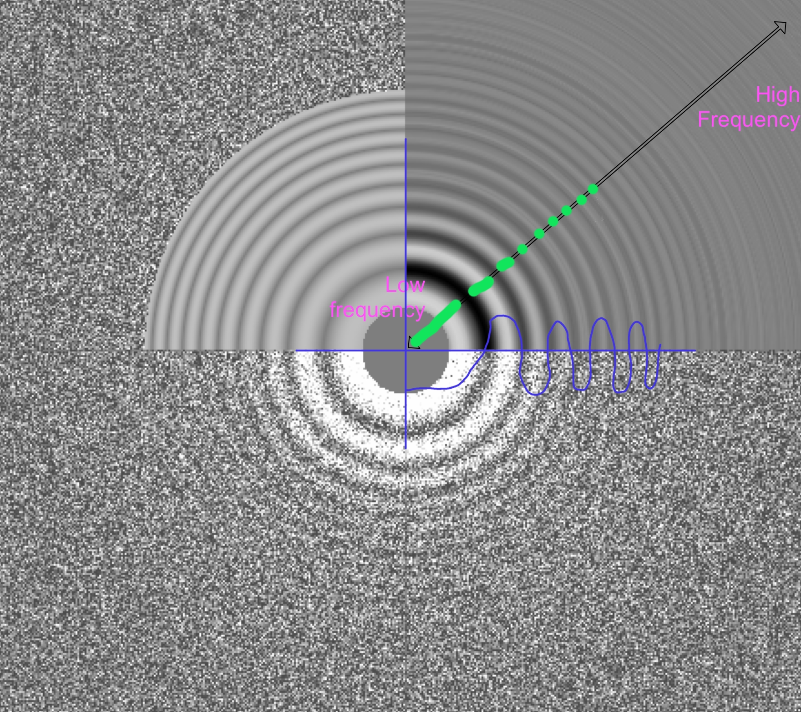

# Prepare Input Data

* [Step 1/29 - Create a Pipeline](#step-129---create-a-pipeline)
* [Step 2/29 - Motion Correction](#step-229---motion-correction)
* [Step 3/29 - CTF Estimation](#step-329---ctf-estimation)

In unit 1 of the tutorial, we are going to prepare input data for the processing on the next steps. It includes motion correction and contrast transfer function estimation.


## Step 1/29 - Create a Pipeline

Tutorial Unit | 1.1 Getting organised
--- | ---
Step Alias | **(1) Import/movies**
Next Step | (2) MotionCorr/own

First, we need to create an input pipeline file for RELION that contains paths to all micrograph files we are going to process, the STAR file.

Click on job type "Import" in job selector, Input the parameters presented in the table below and press "Run" button.

I/O | I/O
--- | ---
Input files | `Movies/*.tiff`
Node type | `2D micrograph movies (*.mrcs, *.tiff)`

The output file will be stored in `Import/movies/` directory.

```
data_
loop_
_rlnMicrographMovieName
Movies/20170629_00022_frameImage.tiff
Movies/20170629_00040_frameImage.tiff
Movies/20170629_00023_frameImage.tiff
Movies/20170629_00043_frameImage.tiff
Movies/20170629_00030_frameImage.tiff
Movies/20170629_00031_frameImage.tiff
Movies/20170629_00021_frameImage.tiff
Movies/20170629_00042_frameImage.tiff
Movies/20170629_00029_frameImage.tiff
Movies/20170629_00037_frameImage.tiff
Movies/20170629_00044_frameImage.tiff
Movies/20170629_00027_frameImage.tiff
Movies/20170629_00039_frameImage.tiff
Movies/20170629_00036_frameImage.tiff
Movies/20170629_00028_frameImage.tiff
Movies/20170629_00026_frameImage.tiff
Movies/20170629_00045_frameImage.tiff
Movies/20170629_00025_frameImage.tiff
Movies/20170629_00046_frameImage.tiff
Movies/20170629_00035_frameImage.tiff
Movies/20170629_00048_frameImage.tiff
Movies/20170629_00047_frameImage.tiff
Movies/20170629_00024_frameImage.tiff
Movies/20170629_00049_frameImage.tiff
```

See the [STAR format] description for details.


## Step 2/29 - Motion Correction

Tutorial Unit | 1.2 Beam-induced motion correction
--- | ---
Previous Step |  *(1) Import/movies*
Step Alias | **(2) MotionCorr/own**
Next Step | (3) CtfFind/ctffind

The set of micrograph files represents a series of photographs taken by the electronic microscope over an observable sample. So, the position of a particular particle on each micrograph differs significantly due to the beam-induced sample motion factor.

That's why the input micrographs should be corrected. The [MotionCorr] application can align micrographs by registering identical features on micrograph frames.

Field name | Field value
--- | ---
**I/O** | **I/O**
Input movies STAR file | `Import/job001/movies.star`
First frame for corrected sum | `1`
Last frame for corrected sum | `0`
Pixel size (A) | `0.885`
Voltage (kV) | `200`
Dose per frame (e/A2) | `1.277`
Pre-exposure (e/A2) | `0`
Do dose-weighting? | `Yes`
Save non-dose weighted as well? | `No`
**Motion** | **Motion**
Bfactor | `150`
Number of patches X | `5`
Number of patches Y | `5`
Group frames | `1`
Binning factor | `1`
Gain-reference image | `Movies/gain.mrc`
Gain rotation | `No rotation (0)`
Gain flip | `No flipping (0)`
Defect file | *Leave empty*
Use RELION's own implementation? | `Yes`

You do not need to install the MotionCorr to complete this tutorial, because RELION has an inner implementation of the same algorithm. Set "Use RELION's own implementation?" field to `Yes` to enable it. Note that **RELION's inner implementation of MotionCorr works on CPU only.**

Job produces two files:

* `corrected_micrographs.star` - similar to `Import/movies/movies.star` but it also has data about accumulated motion: early, late, and total.
* `logfile.pdf` - the visualization of accumulated motion data of the previous file. It also shows particle shifts for each frame.

The content of the `corrected_micrographs.star`.

```
# RELION; version 3.0.3

data_

loop_
_rlnMicrographName #1
_rlnMicrographMetadata #2
_rlnAccumMotionTotal #3
_rlnAccumMotionEarly #4
_rlnAccumMotionLate #5
MotionCorr/job002/Movies/20170629_00022_frameImage.mrc MotionCorr/job002/Movies/20170629_00022_frameImage.star    19.559772     2.483697    17.076075
...
```

**References**

1. [Cryo-tomography tilt-series alignment with consideration of the beam-induced sample motion]
2. [MotionCor2 - anisotropic correction of beam-induced motion for improved cryo-electron microscopy]
3. [Anisotropic Correction of Beam-induced Motion for Improved Singleparticle Electron Cryo-microscopy]


## Step 3/29 - CTF Estimation

Tutorial Unit | 1.3 CTF estimation
--- | ---
Previous Step | *(2) MotionCorr/own*
Step Alias | **(3) CtfFind/ctffind**
Next Steps | (4) ManualPick/illustrate_only
　 | (7) Extract/LoG_based
　 | (11) AutoPick/template_based
　 | (12) Extract/template_based
　 | (20) Extract/best3dclass_bigbox


If you are looking on a micrograph image using the image viewer application you're probably can't see anything on it, even with max zooming. It is because of the wave nature of electronic microscopy. Usually, a magnified image of some sample colud be taken by the following way.

1. The microscope emits electron waves against the sample.
2. The electron wave will be going through the sample and lens,
3. Finally, it will become "printed" on the image plane.



But after a single electron passes the sample, some parts of electron wave scattering in different directions (yellow line on the figure above). And, when scattered waves "touches" the lens, it will be "redirected" back to the original wave's point on image plane. So, the resulting image represented as the sum of the original electron wave and all scattered waves.

Such kind of scattering significantly blurs the resulting image. That's why we need some way to filter "good" data pieces on a micrograph from "bad" ones, in other words - understand a measure of image defocus, and that what "Contrast transfer function" (or CTF) can help us with.

CTF tells us whether a particular component of an image is necessary or not. For example, the image below shows how the visibility of samples depending on proper CTF.



Let's run CTF estimation job in RELION.

Field name | Field value
--- | ---
**I/O** | **I/O**
Input micrographs STAR file | `MotionCorr/job002/corrected_micrographs.star`
Use micrograph without dose-weighting? | `No`
Spherical aberration (mm) | `1.4`
Voltage (kV) | `200`
Amplitude contrast | `0.1`
Magnified pixel size (Angstrom) | `0.885`
Amount of astigmatism (A) | `100`
**Searches** | **Searches**
FFT box size (pix) | `512`
Minimum resolution (A) | `30`
Maximum resolution (A) | `5`
Minimum defocus value (A) | `5000`
Maximum defocus value (A) | `50000`
Defocus step size (A) | `500`
Estimate phase shifts? | `No`
**CTFFIND-4.1** | **CTFFIND-4.1**
Use CTFFIND-4.1? | `Yes`
CTFFIND-4.1 executable | `bin/ctffind`
Use exhaustive search? | `No`
Estimate CTF on window size (pix) | `-1`
**Gctf** | **Gctf**
Use Gctf instead? | `No`

Select the `micrographs_ctf.star` file in the display tab and you can see the estimated CTFs for each micrograph.



Here CTF visualized as a power spectrum, where you can see so-called "Thon rings." Bright rings points on a visible part of the spectrum (positive or negative) defined by CTF, dark rings points on invisible ones. The blue graph shows how Thon rings correlate with CTF function.

**References**

1. [Contrast Transfer Function - Scherzer Defocus]
2. [Contrast transfer function (CTF) correction]
3. [The Contrast Transfer Function - G. Jensen]
4. [Defocus and Its Effects - G. Jensen]


--------------------------------------------------------------------------
← [4 RELION Tutorial] | [Top Page] | [4.2 Laplacian of Gaussian Picking] →
--------------------- | ---------- | -------------------------------------


[STAR format]: https://www3.mrc-lmb.cam.ac.uk/relion/index.php/Conventions_%26_File_formats#The_STAR_format
[MotionCorr]: https://sites.google.com/a/case.edu/hpc-upgraded-cluster/home/Software-Guide/motioncorr
[Cryo-tomography tilt-series alignment with consideration of the beam-induced sample motion]: https://www.sciencedirect.com/science/article/pii/S1047847718300285
[MotionCor2 - anisotropic correction of beam-induced motion for improved cryo-electron microscopy]: https://www.ncbi.nlm.nih.gov/pmc/articles/PMC5494038/
[Anisotropic Correction of Beam-induced Motion for Improved Singleparticle Electron Cryo-microscopy]: https://escholarship.org/content/qt0rx7g4p1/qt0rx7g4p1.pdf
[Contrast Transfer Function - Scherzer Defocus]: https://en.wikipedia.org/wiki/Contrast_transfer_function#Scherzer_defocus
[Contrast transfer function (CTF) correction]: https://spider.wadsworth.org/spider_doc/spider/docs/techs/ctf/ctf.html
[The Contrast Transfer Function - G. Jensen]: https://www.youtube.com/watch?v=mPynoF2j6zc
[Defocus and Its Effects - G. Jensen]: https://www.youtube.com/watch?v=izLp5vpoFyQ
[4 RELION Tutorial]: ./4%20RELION%20Tutorial.md
[Top Page]: https://github.com/xtreme-d/relion-tutorial-simplified
[4.2 Laplacian of Gaussian Picking]: ./4-2%20Laplacian%20of%20Gaussian%20Picking.md
